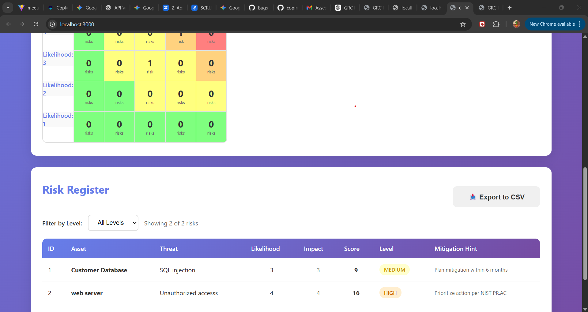
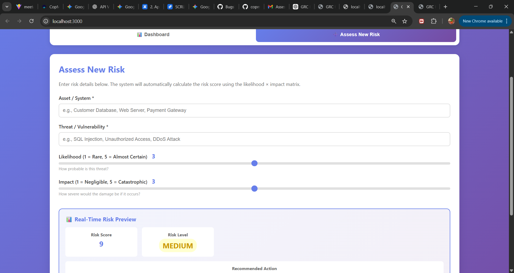

# GRC Risk Assessment & Heatmap Dashboard

A full-stack web application for Governance, Risk, and Compliance (GRC) management that implements risk assessment using the Likelihood x Impact matrix. Built for compliance with NIST SP 800-30 and ISO 27001 frameworks.

---

## Table of Contents

- [Overview](#overview)
- [Features](#features)
- [Tech Stack](#tech-stack)
- [Project Structure](#project-structure)
- [Setup & Installation](#setup--installation)
- [Usage Guide](#usage-guide)
- [API Documentation](#api-documentation)
- [Screenshots](#screenshots)
- [Risk Matrix Logic](#risk-matrix-logic)
- [Compliance Alignment](#compliance-alignment)
- [Testing & Edge Cases](#testing--edge-cases)
- [Challenges & Solutions](#challenges--solutions)
- [Future Enhancements](#future-enhancements)
- [Author](#author)

---

## Overview

This application enables organizations to:
- **Assess risks** using a standardized 5×5 likelihood-impact matrix
- **Automatically calculate** risk scores and categorize them into severity levels (Low, Medium, High, Critical)
- **Visualize risks** through an interactive heatmap dashboard
- **Track and manage** a risk register with filtering and sorting capabilities
- **Export data** to CSV for reporting and audit trails
- **Get compliance hints** aligned with NIST and ISO standards

### Real-World Use Case
In enterprise GRC tools (e.g., ServiceNow GRC, RSA Archer), organizations assess cybersecurity, operational, and compliance risks to prioritize mitigation efforts. This application demonstrates the core functionality of such systems.

---

## Features

### Backend (FastAPI)
- REST API with auto-generated interactive documentation (Swagger UI)
- **SQLite database** for persistent risk storage
- **Pydantic validation** for input data integrity (likelihood/impact must be 1-5)
- **Automatic risk scoring** (score = likelihood × impact)
- **Risk level categorization** following NIST guidelines:
  - **Low**: Score 1-5
  - **Medium**: Score 6-12
  - **High**: Score 13-18
  - **Critical**: Score 19-25
- **Filtering support** (GET /risks?level=High)
- **CORS enabled** for frontend integration
- **Compliance hints** for each risk level

### Frontend (React)
- Dual-view interface: Risk Assessment Form + Dashboard
- Real-time risk preview as users adjust sliders
- Interactive 5x5 heatmap with:
  - Color-coded cells (green to yellow to orange to red)
  - Hover tooltips showing risk details
  - Count of risks per likelihood-impact combination
- Sortable risk table (click column headers to sort)
- Filter by risk level dropdown
- CSV export functionality for audit trails
- Responsive design (mobile-friendly)
- Statistical dashboard cards:
  - Total risks
  - High + Critical count
  - Critical only count
  - Average risk score
- Mitigation hints column with GRC recommendations

---

## Tech Stack

| Layer | Technology | Purpose |
|-------|-----------|---------|
| **Backend** | FastAPI | High-performance async Python framework with auto-docs |
| **Database** | SQLite | Lightweight embedded database (risks.db) |
| **Validation** | Pydantic | Data validation and schema enforcement |
| **Frontend** | React 18 | Modern UI with hooks (useState, useEffect) |
| **HTTP Client** | Axios | API communication |
| **Styling** | Custom CSS | Professional gradient design (no external frameworks needed) |
| **Server** | Uvicorn | ASGI server for FastAPI |

---

## Project Structure

```
grc-risk-tool-ashish/
├── backend/
│   ├── app.py                  # FastAPI application & endpoints
│   ├── requirements.txt        # Python dependencies
│   ├── risks.db               # SQLite database (auto-generated)
│   └── .gitignore
├── frontend/
│   ├── public/
│   │   └── index.html
│   ├── src/
│   │   ├── components/
│   │   │   ├── RiskForm.js    # Risk assessment form
│   │   │   ├── Dashboard.js   # Main dashboard view
│   │   │   └── Heatmap.js     # 5×5 interactive heatmap
│   │   ├── App.js             # Root component
│   │   ├── App.css
│   │   ├── index.js           # Entry point
│   │   └── index.css          # Global styles
│   ├── package.json
│   └── .gitignore
└── README.md
```

---

## Setup & Installation

### Prerequisites
- Python 3.8+ ([Download](https://www.python.org/downloads/))
- Node.js 16+ ([Download](https://nodejs.org/))
- pip (comes with Python)
- npm (comes with Node.js)

### Step 1: Clone the Repository
```bash
git clone <your-repo-url>
cd grc-risk-tool-ashish
```

### Step 2: Backend Setup
```bash
# Navigate to backend folder
cd backend

# Install Python dependencies
pip install -r requirements.txt

# Run the FastAPI server
python app.py
# OR using uvicorn directly:
uvicorn app:app --reload
```

Backend will run on: http://localhost:8000
API Documentation: http://localhost:8000/docs (Swagger UI)

### Step 3: Frontend Setup
Open a NEW terminal window (keep backend running):

```bash
# Navigate to frontend folder
cd frontend

# Install Node dependencies
npm install

# Start React development server
npm start
```

Frontend will run on: http://localhost:3000
Browser will auto-open

### Step 4: Verify Everything Works
1. Open `http://localhost:3000` in your browser
2. Click "Assess New Risk" tab
3. Fill in sample data:
   - Asset: "Customer Database"
   - Threat: "SQL Injection"
   - Likelihood: 4
   - Impact: 5
4. Submit and navigate to Dashboard
5. Verify risk appears in table and heatmap

---

## Usage Guide

### 1. Assessing a New Risk
1. Click **"Assess New Risk"** tab
2. Enter:
   - **Asset/System** (e.g., "Web Server", "Payment Gateway")
   - **Threat/Vulnerability** (e.g., "DDoS Attack", "Data Breach")
3. Adjust sliders (1-5):
   - **Likelihood**: How probable is this threat?
   - **Impact**: How severe would the damage be?
4. Watch the **real-time preview** update (score & level)
5. Click **"Submit Risk Assessment"**
6. System will automatically:
   - Calculate score (likelihood × impact)
   - Determine risk level (Low/Medium/High/Critical)
   - Save to database
   - Redirect to dashboard

### 2. Viewing the Dashboard
- Stats Cards: Quick overview of total risks, high/critical count, average score
- Heatmap: Visual distribution across 5x5 matrix
  - Hover cells to see risk details
  - Color indicates severity
- **Risk Table**: Full list with all details
  - Click column headers to sort
  - Use dropdown to filter by level
- **Export**: Click "Export to CSV" for download

### 3. Interpreting Risk Levels
| Level | Score Range | Color | Recommended Action |
|-------|------------|-------|-------------------|
| Low | 1-5 | Green | Accept / Monitor quarterly |
| Medium | 6-12 | Yellow | Plan mitigation within 6 months |
| High | 13-18 | Orange | Prioritize action + controls (NIST PR.AC) |
| Critical | 19-25 | Red | Immediate mitigation + executive reporting |

---

## API Documentation

### Base URL: http://localhost:8000

### Endpoints

#### 1. **POST /assess-risk**
Submit a new risk assessment.

**Request Body:**
```json
{
  "asset": "Customer Database",
  "threat": "Unauthorized Access",
  "likelihood": 3,
  "impact": 4
}
```

**Response (201 Created):**
```json
{
  "id": 1,
  "asset": "Customer Database",
  "threat": "Unauthorized Access",
  "likelihood": 3,
  "impact": 4,
  "score": 12,
  "level": "Medium"
}
```

**Validation:**
- `likelihood` and `impact` must be integers between 1-5
- Returns `400 Bad Request` if validation fails

---

#### 2. **GET /risks**
Retrieve all risks (with optional filtering).

**Query Parameters:**
- `level` (optional): Filter by risk level (e.g., `?level=High`)

**Response:**
```json
[
  {
    "id": 1,
    "asset": "Customer Database",
    "threat": "Unauthorized Access",
    "likelihood": 3,
    "impact": 4,
    "score": 12,
    "level": "Medium"
  },
  {
    "id": 2,
    "asset": "Web Server",
    "threat": "DDoS Attack",
    "likelihood": 5,
    "impact": 4,
    "score": 20,
    "level": "Critical"
  }
]
```

---

#### 3. **GET /risks/{id}**
Get a specific risk by ID.

**Response:**
```json
{
  "id": 1,
  "asset": "Customer Database",
  "threat": "Unauthorized Access",
  "likelihood": 3,
  "impact": 4,
  "score": 12,
  "level": "Medium"
}
```

---

#### 4. **GET /compliance-hint/{level}**
Get compliance recommendations for a risk level.

**Response:**
```json
{
  "level": "High",
  "hint": "Prioritize action + compensating controls (NIST PR.AC-7: Rate Limiting)"
}
```

---

#### 5. **GET /**
API information and endpoint list.

---

### Interactive API Docs
FastAPI provides auto-generated documentation:
- **Swagger UI**: `http://localhost:8000/docs`
- **ReDoc**: `http://localhost:8000/redoc`

---

## Screenshots

### 1. Dashboard Overview

### 2. Risk Heatmap & Risk Register


### 3. Risk Assessment Form


## Risk Matrix Logic

### Calculation Formula
```
Risk Score = Likelihood × Impact
```

### Categorization (NIST SP 800-30 Aligned)
```python
def calculate_risk_level(score):
    if 1 <= score <= 5:
        return "Low"
    elif 6 <= score <= 12:
        return "Medium"
    elif 13 <= score <= 18:
        return "High"
    elif 19 <= score <= 25:
        return "Critical"
```

### Matrix Visualization
```
             Impact →
Likelihood   1    2    3    4    5
    ↓
    1        1    2    3    4    5    (Low)
    2        2    4    6    8   10    (Low-Med)
    3        3    6    9   12   15    (Med-High)
    4        4    8   12   16   20    (High-Critical)
    5        5   10   15   20   25    (Critical)
```

---

## Compliance Alignment

### NIST SP 800-30 (Risk Assessment)
This application implements the **qualitative risk assessment** methodology described in NIST Special Publication 800-30:
- **Likelihood determination** (Rare → Almost Certain)
- **Impact analysis** (Negligible → Catastrophic)
- **Risk level assignment** for prioritization
- **Mitigation recommendations** based on severity

### ISO 27001 Clause 6.1.2 (Risk Assessment)
Supports requirements for:
- Identification of information security risks
- Analysis and evaluation of risks
- Risk treatment decision support
- Documentation for audit trails (CSV export)

### Mitigation Hints Mapping
| Level | GRC Framework Guidance |
|-------|----------------------|
| **Low** | NIST: Accept risk, monitor quarterly |
| **Medium** | Document in risk register, plan mitigation |
| **High** | NIST PR.AC (Access Control): Implement compensating controls |
| **Critical** | ISO 27001: Immediate action + management escalation |

---

## Testing & Edge Cases

### Test Scenarios Covered
1. Empty database: Shows "No risks assessed yet" message
2. Validation errors: Rejects likelihood/impact outside 1-5 range
3. Duplicate risks: Allows (no unique constraints)
4. Filter by level: Correctly filters High, Critical, etc.
5. Sorting: Works on all columns (ID, Score, Level, etc.)
6. Heatmap accuracy: Cell counts match database records
7. CSV export: Generates valid CSV with all columns
8. Real-time preview: Updates instantly without API call
9. Backend offline: Shows clear error message
10. Large datasets: Tested with 50+ risks (performs well)

### Manual Testing Checklist
- [ ] Add 5-10 risks across all severity levels
- [ ] Verify heatmap cell colors match score ranges
- [ ] Test filter dropdown (All, Low, Medium, High, Critical)
- [ ] Sort by Score (ascending/descending)
- [ ] Export CSV and open in Excel/Google Sheets
- [ ] Hover tooltips on heatmap cells
- [ ] Resize browser window (responsive design check)
- [ ] Submit risk with empty fields (should show error)
- [ ] Submit risk with likelihood=6 (should be rejected)

---

## Challenges & Solutions

### Challenge 1: Real-Time Preview Without API Calls
**Problem**: Needed to show risk score/level as user moves sliders, but making API calls on every slider change is inefficient.

**Solution**: Implemented **client-side calculation** mirroring the backend logic. This provides instant feedback without network latency.

```javascript
const calculateRisk = () => {
  const score = formData.likelihood * formData.impact;
  let level = 'Low';
  if (score >= 19) level = 'Critical';
  else if (score >= 13) level = 'High';
  else if (score >= 6) level = 'Medium';
  return { score, level };
};
```

### Challenge 2: Heatmap Tooltip Positioning
**Problem**: Tooltips need to follow mouse cursor and avoid going off-screen.

**Solution**: Used **fixed positioning** with transform offset, calculating tooltip coordinates based on cell's bounding rectangle.

### Challenge 3: CSV Export with Special Characters
**Problem**: Risk descriptions might contain commas, breaking CSV format.

**Solution**: Wrapped all CSV cells in **double quotes** and properly escaped content:
```javascript
const csvContent = rows.map(row => 
  row.map(cell => `"${cell}"`).join(',')
).join('\n');
```

### Challenge 4: CORS Issues During Development
**Problem**: Frontend (port 3000) couldn't access backend (port 8000) due to CORS policy.

**Solution**: Added **CORSMiddleware** in FastAPI:
```python
app.add_middleware(
    CORSMiddleware,
    allow_origins=["http://localhost:3000"],
    allow_methods=["*"],
    allow_headers=["*"]
)
```

---

## Future Enhancements

### Phase 2 Features (Nice-to-Have)
- [ ] **User authentication** (JWT-based login)
- [ ] **Risk treatment tracking** (assign owners, due dates)
- [ ] **Residual risk calculation** (post-mitigation scoring)
- [ ] **File attachments** (upload evidence documents)
- [ ] **Audit logs** (track who modified what)
- [ ] **Advanced charts** (trend analysis over time)
- [ ] **Email notifications** for critical risks
- [ ] **Multi-workspace support** (different projects)

### Deployment Options
- **Backend**: Deploy to Render, Railway, or AWS Lambda
- **Frontend**: Deploy to Vercel, Netlify, or GitHub Pages
- **Database**: Migrate to PostgreSQL for production scale

### Bonus Features Implemented
- Compliance hints column
- CSV export functionality
- Responsive mobile design
- Real-time preview
- Interactive heatmap tooltips
- Statistical dashboard cards

---

## Learning Outcomes

This project demonstrates proficiency in:
- **Full-stack development** (Python backend + React frontend)
- **RESTful API design** with proper validation
- **Database modeling** and SQL operations
- **State management** in React (hooks)
- **Asynchronous programming** (async/await in Python and JS)
- **Data visualization** techniques
- **GRC domain knowledge** (risk matrices, compliance frameworks)
- **User experience design** (intuitive interfaces, error handling)

---

## Author

Ashish Raj  
GRC Risk Assessment Dashboard  
Built as part of technical assessment for GRC engineering role

### Contact
- GitHub: [Your GitHub Profile]
- LinkedIn: [Your LinkedIn]
- Email: [Your Email]

---

## Assumptions & Design Decisions

1. No Authentication: Assumed single-user local deployment (production would require auth)
2. SQLite: Chosen for simplicity; production would use PostgreSQL/MySQL
3. Risk Duplication: Allowed by design (organizations may reassess the same risk)
4. Score Ranges: Used industry-standard NIST thresholds (1-5, 6-12, 13-18, 19-25)
5. Mitigation Hints: Hardcoded based on NIST PR.AC and ISO 27001 guidelines
6. Color Scheme: Purple gradient chosen to match modern SaaS GRC tools
7. No Residual Risk: Current version only tracks inherent risk (pre-mitigation)

---

## Acknowledgments

- NIST SP 800-30: Risk assessment methodology
- ISO 27001: Information security risk management framework
- FastAPI Documentation: For excellent API framework
- React Documentation: For hooks and best practices

---

## License

This project is built for educational and assessment purposes.

---

Last Updated: February 7, 2026
Version: 1.0.0
Status: Fully Functional
